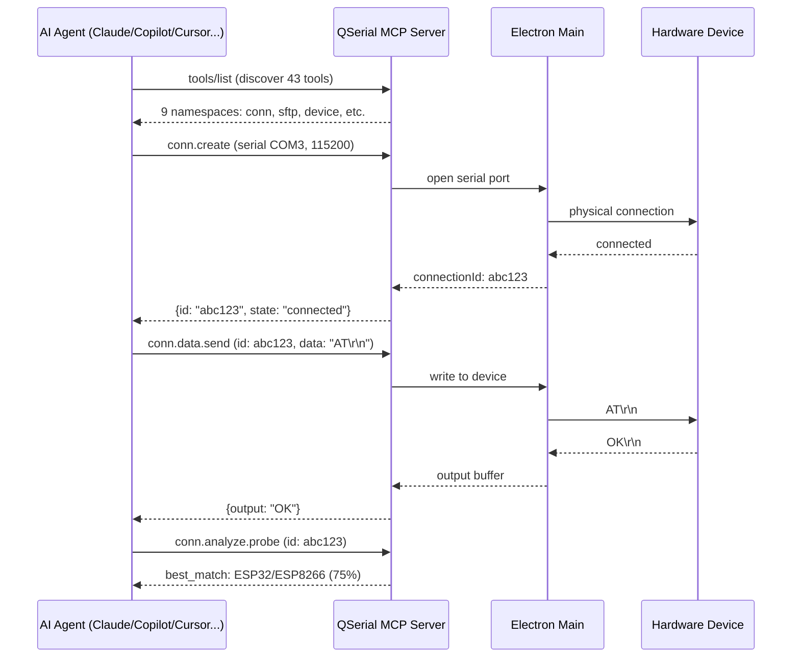

# QSerial

AI-powered serial console and device management tool. Built on Electron + MCP (Model Context Protocol).

## Architecture — How AI Interacts with Your Hardware



## Quick Start

```powershell
pnpm install
pnpm run dev      # dev mode with hot reload
pnpm start        # run pre-built app
pnpm run package:win  # build Windows installer + portable exe
```

## MCP Client Config

Add to your AI client's MCP configuration:

```json
{"mcpServers":{"qserial":{"type":"streamable-http","url":"http://127.0.0.1:9800/mcp"}}}
```

## Capabilities

| Category | Tools | Description |
|----------|-------|-------------|
| Connection | `conn.create/list/disconnect/reconnect` | Manage serial, SSH, Telnet, PTY connections |
| Data I/O | `conn.data.send/read/expect/history` | Send commands, read output, pattern matching |
| Scripting | `conn.script.run/login` | Multi-step scripts, auto-login |
| Analysis | `conn.analyze.state/probe/report` | Device detection (21 types), state analysis |
| File Transfer | `sftp.*`, `conn.file.send` | SFTP, XMODEM/YMODEM |
| Monitoring | `conn.watch.start/stop`, `conn.record.*` | Pattern alerts, session recording |
| Device | `device.ports` | List available serial ports |

## Tech Stack

| Layer | Technology |
|-------|-----------|
| Desktop | Electron 35, React 18, TypeScript |
| Terminal | xterm.js 5 |
| Styling | Tailwind CSS |
| State | Zustand + immer |
| Protocol | MCP (Model Context Protocol) over Streamable HTTP / SSE |
| Testing | Vitest (97 tests) |
| Build | electron-builder, Vite, pnpm workspace |

## Project Structure

```
packages/
├── main/      # Electron main process, IPC handlers, MCP tools, services
├── renderer/  # React frontend (components, stores, i18n)
└── shared/    # TypeScript types and constants
plugins/       # Community plugins and device models
scripts/       # Build, deploy, packaging, icon scripts
```
